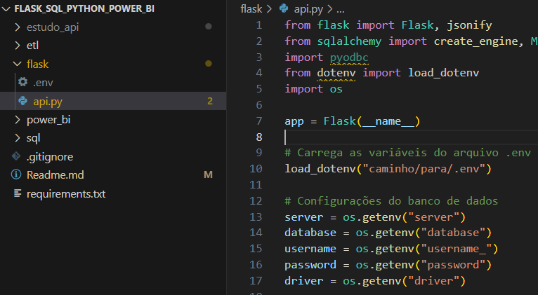
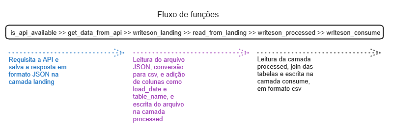
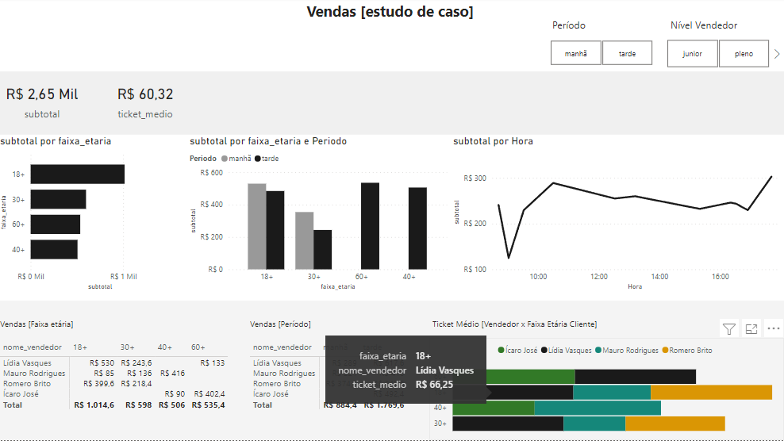

# Análise de dados
Neste repositório continuamos os estudos de análise de dados, utilizando o mesmo conjunto de dados utilizado em .

Mas aqui faremos algumas mudanças, com a finalidade de avançar na utilização de técnicas.

Aqui teremos um banco de dados SQLSERVER servindo uma API com os dados, e utilizaremos Python para coletar, tratar e salvar os dados da API em formato CSV.

Neste estudo são utilizados conceitos de modelagem de dados para Datalake (Embora a arquitetura não seja hospedada em nuvem, a metodologia é similar) e modelagem Star Schema.

## Ambiente
O primeiro passo para iniciar o ambiente é criar um ambiente virtual. Você pode utilizar o método que estiver mais familiarizado para isso.

Caso não esteja familiarizado com nenhum, você pode executar:

```
python -m venv estudo_api
```

Esse comando irá criar um ambiente virtual para que as bibliotecas sejam instaladas.

Após ativar o ambiente virtual, execute.

```
pip install -r requirements.txt
```

Este comando instalará os pacotes e suas versões contidos no arquivo requirements.txt.

```
Flask==2.0.3
SQLAlchemy==1.4.25
pyodbc==4.0.32
Werkzeug==2.0.3
PyMySQL==1.0.2
requests
pandas==2.2.2
python-dotenv==1.0.1 
```

Feito isso, será possível notar uma pasta nova no diretório, com o nome escolhido para o ambiente virtual.

## SQLSERVER
Execute o arquivo sql\criar_tabelas.sql. Isso criará as tabelas de exemplo, que servirão a API.

## Flask
Crie um arquivo chamado .env na mesma pasta da aplicação FLask, com os seguintes dados:

```
server = 'seu server'
database = 'nome do banco'
username = 'user '
password = 'senha'
driver = 'driver para sqlserver aqui usei esse ODBC Driver 17 for SQL Server'
```
Execute o arquivo flask\api.py. Ele tornará disponível a API para os dados contidos no banco de dados. <br>

***Atenção para o preenchimento do arquivo .env, pois ele é que montará a string de conexão.*** <br>


## ETL Python
A aplicação que coleta os dados, transforma e carrega na pasta para consumo, utiliza diversas bibliotecas Python, como Pandas, Json e Requests.

Um panorama da arquitetura é:



## Power BI


