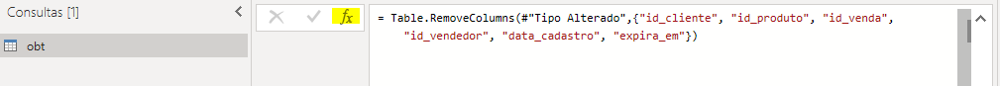
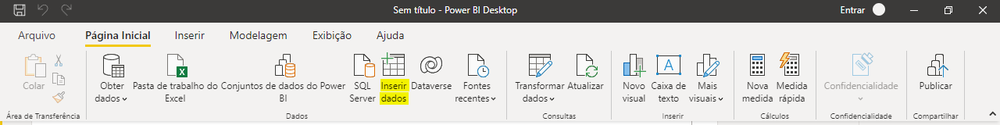
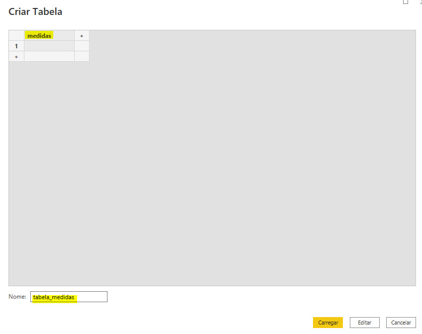
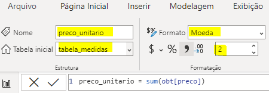

Ao abrir o Power BI Desktop

Obter Dados -> csv -> selecione o arquivo obt.csv armazenado na pasta consume

Acesse Transformar Dados

A primeira tarefa será remover colunas que não serão utilizadas. Clique na opção **Adicionar Etapa** conforme indicado na imagem abaixo:


Copie o código M destacado e cole na barra de fórmulas, substituindo o conteúdo apresentado.

```
= Table.RemoveColumns(#"Tipo Alterado",{"id_cliente", "id_produto", "id_venda", "id_vendedor", "data_cadastro", "expira_em"})
```
Há uma etapa em que o Power BI pode inferir os tipos de dados de maneira incorreta, logo após a etapa chamada Promover Cabeçalhos; remova essa etapa e inclua essas duas no lugar.

O código criará uma etapa que remove as colunas indicadas entre {}.

Repita o mesmo processo usando os códigos abaixo <br>

***Formatando os campos monetários e decimais***
```
= Table.TransformColumnTypes(#"Cabeçalhos Promovidos", {{"preco", Currency.Type},{"custo", Currency.Type},{"valor", Currency.Type}, {"margem_lucro", type number}}, "en-US")
```

***Formatando os campos Data/Hora***
```
= Table.TransformColumnTypes(#"Tipo Alterado com Localidade", {{"data_venda", type datetimezone}}, "pt-BR")
```

***Formatando os campos  Inteiros***
```
= Table.TransformColumnTypes(#"Tipo Alterado com Localidade",{{"quantidade", Int64.Type}, {"idade", Int64.Type}})
```

***Adiciona campo HORA***
```
= Table.AddColumn(Personalizar1, "Hora", each DateTime.Time([data_venda]), type time)
```

***Adiciona o período***
```
= Table.AddColumn(Personalizar2, "Periodo", each if (Time.From([Hora]) >= #time(00, 00, 00) and Time.From([Hora]) < #time(12, 00, 00)) then "manhã"
else if (Time.From([Hora]) >= #time(12, 00, 00) and Time.From([Hora]) < #time(18, 00, 00)) then "tarde"
else "noite")
```

***Formata a coluna como texto***
```
= Table.TransformColumnTypes(#"Personalização Adicionada",{{"Periodo", type text}})
```

***Adiciona faixa etária***
```
= Table.AddColumn(#"Tipo Alterado1", "faixa_etaria", each if [idade] >= 60 then "60+" 
else if [idade] >= 40 then "40+" 
else if [idade] >= 30 then "30+" 
else if [idade] >= 18 then "18+" 
else "")
```

***Formata a coluna como texto***
```
= Table.TransformColumnTypes(#"Personalização Adicionada1",{{"faixa_etaria", type text}})
```

Clique em Fechar/Aplicar

Agora será criada uma tabela para armazenar as medidas DAX. Para isso acesse o comando Inserir Dados. <br>

***Inserir dados***


***Nomeando tabela e coluna*** <br>


***Inserindo medidas***
 <br>

Ao inserir medidas, certifique-se de que os campos destacados na imagem estão de acordo com o esperado.

***preco_unitario***
```
preco_unitario = sum(obt[preco])
```

***custo_unitario***
```
custo_unitario = sum(obt[custo])
```

***quantidade***
```
quantidade = sum(obt[quantidade])
```

***subtotal***
```
subtotal = SUMX(obt, [quantidade] * [preco_unitario])
```

***ticket_medio***
```
ticket_medio = tabela_medidas[subtotal] / [quantidade]
```